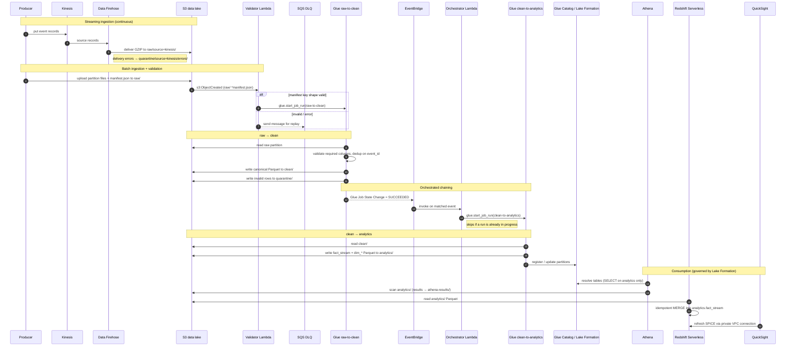
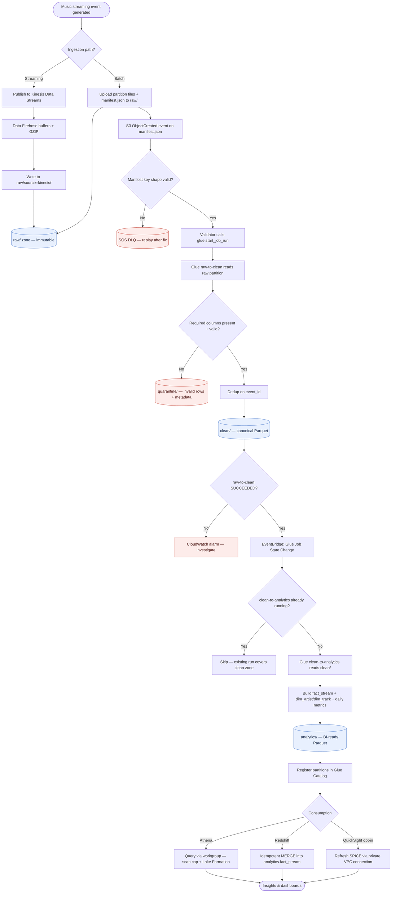

# Pipeline architecture diagrams

Visual reference for the Music Streaming ETL platform (`dev`, `ap-southeast-1`).
Data flows **raw → clean → analytics** across S3 zones, driven by Lambda + Glue,
and is consumed through Athena, Redshift Serverless, and (opt-in) QuickSight.
Names shown are the deployed `music-etl-dev-*` resources.

## Components diagram

How the AWS services are wired together, grouped by responsibility.

```mermaid
flowchart LR
    %% ---------- Ingestion ----------
    subgraph ingest["Ingestion"]
        PROD["Event producers"]
        KDS["Kinesis Data Streams<br/>music-etl-dev-events"]
        FH["Amazon Data Firehose<br/>music-etl-dev-raw-delivery"]
        BATCH["Batch source<br/>Kaggle files + manifest.json"]
    end

    %% ---------- Data lake (S3) ----------
    subgraph lake["Data lake — S3 (SSE-KMS, versioned, TLS-only)"]
        RAW["raw/"]
        CLEAN["clean/"]
        ANALYTICS["analytics/"]
        QUAR["quarantine/"]
        ARES["athena-results/"]
        GA["glue-assets bucket<br/>scripts + quality library"]
    end

    %% ---------- Orchestration + ETL ----------
    subgraph etl["Orchestration & ETL"]
        S3EVT["S3 event notification<br/>prefix raw/ · suffix manifest.json"]
        VAL["Lambda validator<br/>manifest-validator"]
        DLQ["SQS DLQ<br/>manifest-dlq"]
        R2C["Glue job<br/>raw-to-clean"]
        EB["EventBridge rule<br/>Glue Job State Change = SUCCEEDED"]
        ORCH["Lambda orchestrator<br/>glue-orchestrator"]
        C2A["Glue job<br/>clean-to-analytics"]
        QLIB["Quality library<br/>required-column check · dedup on event_id"]
    end

    %% ---------- Analytics + consumption ----------
    subgraph consume["Analytics & consumption"]
        CATALOG["Glue Data Catalog<br/>music_raw · music_clean · music_analytics"]
        ATHENA["Athena workgroup<br/>bytes-scanned cap"]
        REDSHIFT["Redshift Serverless<br/>MERGE into analytics.fact_stream"]
        QS["QuickSight (opt-in)<br/>SPICE · private VPC connection"]
    end

    %% ---------- Cross-cutting ----------
    subgraph govern["Governance & observability"]
        LF["Lake Formation<br/>analytics-reader = analytics only, raw denied"]
        CW["CloudWatch<br/>log groups · alarms · dashboard"]
    end

    %% Ingestion edges
    PROD --> KDS
    KDS --> FH
    FH -->|"raw/source=kinesis/"| RAW
    BATCH -->|"upload + manifest"| RAW

    %% Batch trigger + validation
    RAW -. "manifest.json created" .-> S3EVT
    S3EVT --> VAL
    VAL -->|"glue.start_job_run"| R2C
    VAL -. "on failure" .-> DLQ

    %% raw-to-clean
    RAW --> R2C
    R2C -->|"valid rows"| CLEAN
    R2C -->|"invalid rows"| QUAR
    QLIB -. "used by" .-> R2C
    QLIB -. "used by" .-> C2A

    %% chaining raw-to-clean -> clean-to-analytics
    R2C -. "SUCCEEDED" .-> EB
    EB --> ORCH
    ORCH -->|"glue.start_job_run"| C2A
    CLEAN --> C2A
    C2A -->|"BI models"| ANALYTICS

    %% glue assets
    GA -. "scripts + libs" .-> R2C
    GA -. "scripts + libs" .-> C2A

    %% consumption
    ANALYTICS --> CATALOG
    ATHENA --> CATALOG
    ATHENA --> ARES
    REDSHIFT -->|"read Parquet"| ANALYTICS
    QS --> REDSHIFT

    %% governance + observability
    LF -. "governs" .-> CATALOG
    CW -. "monitors" .-> VAL
    CW -. "monitors" .-> R2C
    CW -. "monitors" .-> C2A
    CW -. "monitors" .-> REDSHIFT

    classDef store fill:#e8f0fe,stroke:#4877c9,color:#1a2b4a;
    classDef compute fill:#eafaf1,stroke:#3fa66a,color:#123524;
    classDef gov fill:#fdf3e7,stroke:#d08a2c,color:#4a2f10;
    class RAW,CLEAN,ANALYTICS,QUAR,ARES,GA store;
    class VAL,R2C,C2A,ORCH,ATHENA,REDSHIFT,QS compute;
    class LF,CW,DLQ gov;
```

## Sequence diagram

End-to-end processing for a batch partition, plus the parallel streaming path
and downstream consumption.

## Flow diagram

The data's journey from ingestion to insight, with the decision points that route
records to `clean/`, `quarantine/`, or the DLQ.

## Legend

- **Solid arrows** — data movement or a synchronous call (e.g. `start_job_run`).
- **Dotted arrows** — an event/trigger or a governance/monitoring relationship.
- **Diamonds** (flow diagram) — decision points; red nodes are fault paths
  (`quarantine/`, DLQ, alarm) that never mutate `raw/`.
- **quarantine/** receives both record-level rejections (from Glue) and Data Firehose
  delivery errors; raw data is never mutated.
- Streaming (Kinesis → Data Firehose) and batch (manifest → validator) are independent
  ingestion paths that converge in `raw/` and share the same downstream Glue jobs.
- QuickSight is opt-in (`quicksight_enabled = false` by default); the rest of the
  stack is always deployed.

> Source of truth is Terraform under `terraform/`; update these diagrams when the
> module wiring, orchestration, or data zones change.
